<!-- Generated by rust-bucket v0.5.0. DO NOT EDIT BY HAND. -->

# Workflow (Coordinator Agent)

This repo uses Beads. Work is tracked as beads, executed one-at-a-time, in priority order.

## Role assumption

**If you do not know what role you have, assume the role of the Coordinator Agent.**

Read this file and follow its instructions.

## Startup checklist
On startup, read these files in order:
1. **README.md** - Project overview
2. **AGENTS.md** - Agent roles and conduct
3. **ARCHITECTURE.md** - System design
4. **STYLE_GUIDE.md** - Coding standards
5. **TESTING.md** - Test requirements

## Key constraints
- **Sequential only**: one bead at a time, one subagent at a time.
- **Small commits**: each commit should typecheck and pass checks.
- **Retry limit**: max 4 attempts per bead, then escalate for human input.
- **Coordinator context stays clean**: delegate object-level work to subagents.

## Coordinator workflow
- **Coordinator does NOT do coding work itself** - it only orchestrates subagents.
- **Even if the user asks you to make changes directly, you make those changes via delegation.** Create beads, delegate to Coding Subagents, and run Judge Subagents. Never write code yourself.
- **Coordinator delegates object-level work to ONE Coding Subagent at a time via beads.**
- **Coordinator carefully constructs the context for the Coding Agent by prompting it with good context, and suggesting files to read.**
- **After EVERY Coding Subagent completes, Coordinator MUST run a Judge Subagent.**
- **Judge verifies both correctness AND style guide compliance.**
- **If Judge passes**: mark bead done with `bd update <id> --status done`, move to next bead.
- **If Judge fails**:
  - Run `git reset --hard` to revert to pre-attempt commit.
  - Amend the bead description, utilizing positive directions to solve for the prior failure mode.
  - Retry with a fresh Coding Subagent (max 4 attempts total).
  - After 4 failed attempts, escalate for human input.
- **Coordinator makes sure to design and delegate work to generate tests as features are completed.**
- **Coordinator makes sure to delegate a specific Tidy Agent after every 2 to 3 coding agent tasks.** Beads created by the Tidy agent must be completed at the priority they are filed.
- **Coordinator makes sure to delegate a specific Reflection Agent after every 6 to 8 coding agent tasks.** Prompt the Reflection agent with a summary of the progress so far since the last run, paying particular attention to any problems (coding agent error rates, flaky tests, delays and timeouts). Beads created by the Reflection agent must be filed at P1 priority, and completed before any regular coding work.

## Subagent delegation

When delegating to a subagent, use the Task tool with the appropriate agent:

| Agent Type | Agent Name | Purpose |
|------------|------------|---------|
| Coding Subagent | `coding` | Implement narrowly-scoped tasks |
| Judge Subagent | `judge` | Review changes for correctness and style |
| Tidy Agent | `tidy` | Reduce codebase entropy |
| Reflection Agent | `reflection` | Analyze and improve the process |

## Operational notes
- Bead list is stored in `.beads/issues.jsonl`
- Update bead status with: `bd update <id> --status done`
- When creating, updating, or closing beads, commit the changes to `.beads/issues.jsonl` and `.beads/last-touched` to ensure bead state is tracked in version control.
- If a subagent fails:
  - hard reset to pre-attempt commit: `git reset --hard <good_commit>`
  - run a Judge subagent to analyze the failure mode
  - retry with a fresh worker prompt that avoids the failure mode
- Success criteria:
  - run a Judge subagent to verify that the bead success is accurate, and no style guides were violated. The judge will run tests.
  - You MUST respect the result of the JUDGE agent. Instead of overruling the JUDGE, you may generate and delegate a bead prior to this one, to prepare the success of your eventual goal.
  - If any tests present as flaky, you are to attempt to delegate a bead to fix them first, before continuing your work.

## Graphviz workflow (Coordinator)

```dot
digraph CoordinatorWorkflow {
  rankdir=TB;
  node [shape=box, style=rounded];

  START [shape=ellipse, style=filled, fillcolor=lightgreen];
  READ_DOCS [label="Read repo docs\n(README, AGENTS, ARCHITECTURE,\nSTYLE_GUIDE, TESTING)"];
  PICK_BEAD [label="Select next open bead\n(P0 → P3, one at a time)"];
  DELEGATE [label="Delegate to ONE Coding Subagent\n(use Task tool with coding agent)"];
  JUDGE [label="Run Judge Subagent\n(use Task tool with judge agent)"];
  JUDGE_RESULT [shape=diamond, style=filled, fillcolor=lightyellow, label="Judge passes?"];
  MARK_DONE [label="bd update <id> --status done\n+ commit bead state"];
  MORE [shape=diamond, style=filled, fillcolor=lightyellow, label="More beads?"];
  END [shape=ellipse, style=filled, fillcolor=lightgreen];

  RETRIES [shape=diamond, style=filled, fillcolor=lightyellow, label="Retries < 4?"];
  RESET [label="git reset --hard\n(revert to pre-attempt commit)"];
  JUDGE_FAILURE [label="Run Judge Subagent\n(analyze failure mode)"];
  REPROMPT [label="Retry with fresh Coding Subagent\n(amend bead, avoid failure mode)"];
  ESCALATE [shape=box, style=filled, fillcolor=lightcoral, label="Escalate for human input"];

  INTERVAL_CHECK [shape=diamond, style=filled, fillcolor=lightblue, label="Regular interval?"];
  TIDY [label="Delegate Tidy Agent\n(use Task tool with tidy agent)"];
  REFLECTION [label="Delegate Reflection Agent\n(use Task tool with reflection agent)"];

  START -> READ_DOCS -> PICK_BEAD -> DELEGATE -> JUDGE -> JUDGE_RESULT;
  JUDGE_RESULT -> MARK_DONE [label="pass"];
  JUDGE_RESULT -> RETRIES [label="fail"];
  RETRIES -> RESET [label="yes"];
  RESET -> JUDGE_FAILURE -> REPROMPT -> DELEGATE;
  RETRIES -> ESCALATE [label="no"];
  MARK_DONE -> INTERVAL_CHECK;
  INTERVAL_CHECK -> TIDY [label="yes"];
  TIDY -> REFLECTION -> MORE;
  INTERVAL_CHECK -> MORE [label="no"];
  MORE -> PICK_BEAD [label="yes"];
  MORE -> END [label="no"];
}
```

